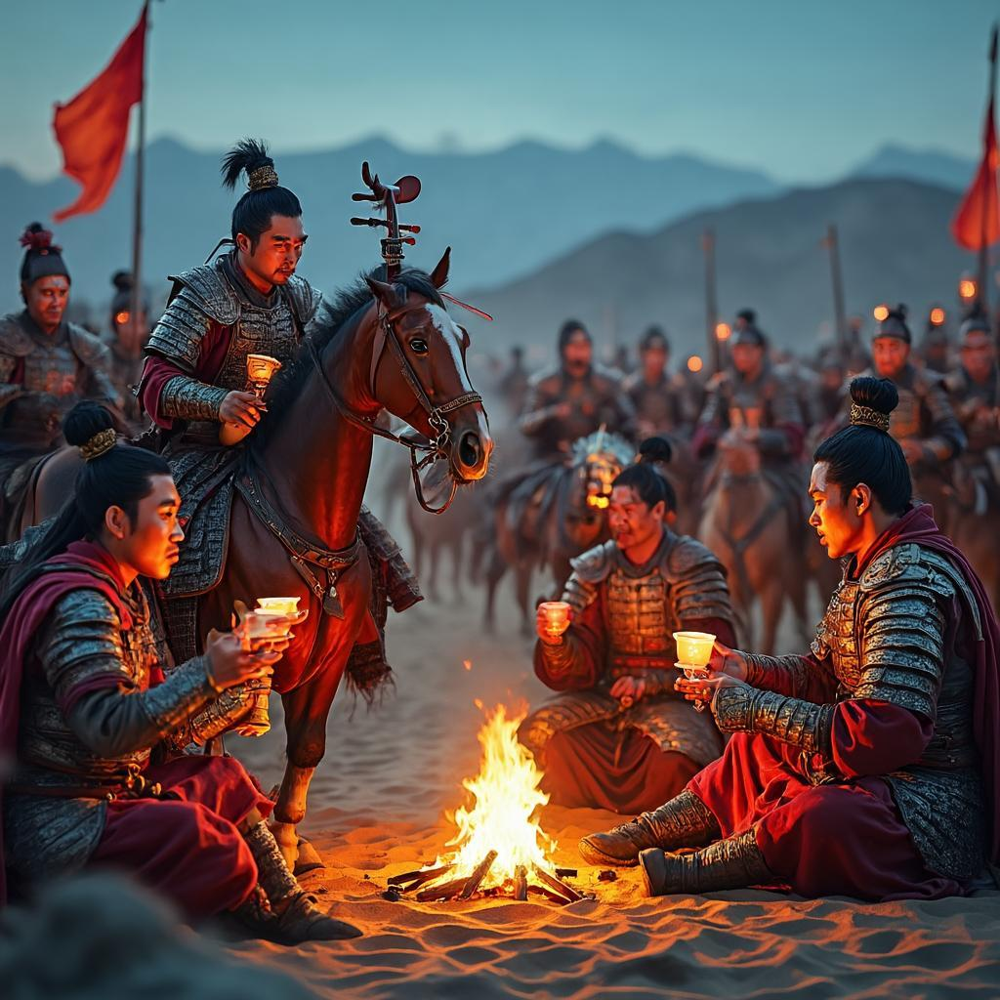

# 凉州词
**作者**：王翰 ｜ **朝代**：唐代

## 🎵 诗词朗读
<audio controls>
  <source src="./data/mp3/凉州词_audio.mp3" type="audio/mpeg">
  您的浏览器不支持音频播放。
</audio>

📥 [下载音频文件](./data/mp3/凉州词_audio.mp3)

## 🖼️ 诗意画境


🖼️ [查看原图](./data/images/凉州词_王翰.jpg)

---
## 📜 原文
```
葡萄美酒夜光杯，
欲饮琵琶马上催。
醉卧沙场君莫笑，
古来征战几人回。
```
## 🎯 主题
《凉州词》通过描绘边塞将士饮酒的场景和即将出征的紧张气氛，展现了唐代边塞军旅生活的豪迈与悲壮。诗中既有对异域风情的描绘，也有对将士们面对生死考验时豁达态度的赞美，更深刻揭示了战争的残酷本质和将士们面临的生死命运。全诗在豪放的表象下，蕴含着对战争的深刻思考和对将士命运的深切同情，体现了唐代边塞诗特有的悲壮美和人文关怀。
## 🏗️ 结构
《凉州词》作为一首七言绝句，其结构特点体现了唐代边塞诗的典型章法布局与层次安排。

从章法布局看，这首诗采用了"景-情"的结构模式。前两句"葡萄美酒夜光杯，欲饮琵琶马上催"构成一个完整的场景描写，展现了边塞将士生活的片段；后两句"醉卧沙场君莫笑，古来征战几人回"则转向情感抒发，表达对战争的深刻思考。这种前半叙事、后半议论的结构安排，使诗歌在有限的篇幅内完成了从具体到抽象、从现象到本质的升华。

在层次安排上，全诗呈现出清晰的递进关系。第一层次（第一句）描绘边塞生活的美好一面，以"葡萄美酒"和"夜光杯"这些具有西域特色的物品，营造出奢华欢愉的氛围；第二层次（第二句）引入军情紧急的转折，"琵琶马上催"打破了前句的宁静，形成鲜明对比；第三层次（第三句）表达将士面对战争的豪放态度，"醉卧沙场"展现了他们的不羁与豁达；第四层次（第四句）则揭示战争的残酷本质，以反问的形式深化主题，引人深思。

诗歌在结构上还体现了巧妙的转折与呼应。从"美酒夜光杯"的奢华到"征战几人回"的残酷，形成了强烈的情感对比；"欲饮"与"醉卧"形成前后呼应，展现了将士从准备饮酒到醉卧沙场的行为变化；"君莫笑"与"古来征战"则构成因果关系，解释了醉卧沙场不应被嘲笑的原因。

此外，这首诗在结构上还体现了"由外而内"的特点，从外在场景描写逐渐转向内心情感表达，最后上升到对战争本质的哲学思考，使诗歌在短小的篇幅中蕴含了丰富的思想内涵，展现了唐代边塞诗独特的艺术魅力。
## ✍️ 语言风格
王翰的《凉州词》是唐代边塞诗的代表作，其语言风格特点鲜明，主要表现在以下几个方面：

用词方面，诗人选择了极具边塞特色的意象，如"葡萄美酒"、"夜光杯"、"琵琶"、"沙场"等，这些词语不仅具有强烈的画面感，也直接呈现了唐代边塞军旅生活的独特风貌。这些具体物象词的使用，使诗歌形象生动，让读者仿佛置身于边塞军营之中。同时，诗人用词极为精炼，全诗仅28个字却勾勒出完整场景和深刻情感，体现了唐诗"言简意丰"的特点。

修辞手法上，对比是这首诗最突出的特点。"葡萄美酒"的欢快与"沙场"的残酷形成对比；"欲饮"的愿望与"马上催"的紧迫形成对比；"醉卧"的放纵与"古来征战几人回"的悲壮形成对比。这些对比增强了诗歌的张力，使情感表达更加丰富深刻。最后一句"古来征战几人回"采用了设问的修辞手法，实际上是反问，暗示征战归来者少，突出了战争的残酷和将士的悲壮命运。此外，诗人还通过借景抒情的手法，将具体景物与情感表达融为一体。

语言风格上，这首诗豪放中带有悲壮。"葡萄美酒"、"醉卧沙场"等表现出边塞将士的豪迈气概；而"古来征战几人回"又透露出深沉的悲壮情感，形成豪放与悲壮的统一。诗歌语言朴实自然，没有过多雕琢，却意味深长。同时，诗歌节奏鲜明，音韵和谐，如"杯"、"催"、"回"押韵，增强了诗歌的音乐美。

表现手法上，诗人运用白描手法，用简洁的笔触勾勒出边塞生活的场景，不加修饰却生动传神。诗歌将抒情与叙事有机结合，既有描述将士饮酒的场景，又有对征战命运的感慨。情景交融也是这首诗的重要特点，景物描写与情感表达融为一体，如"醉卧沙场"既是场景描写，又蕴含了将士的情感态度。

总体而言，王翰的《凉州词》通过精炼的用词、巧妙的修辞手法和独特的语言风格，成功塑造了边塞将士的形象，表达了他们豪迈中带有悲壮的复杂情感，展现了唐代边塞诗的艺术魅力。
## 📚 文化札记
《凉州词》是唐代著名边塞诗，其文化背景丰富多元，需要从多个角度进行解读。

首先，"凉州"是古代地名，位于今甘肃省武威市一带，是丝绸之路上的重要城市和唐代西北边防重镇。"凉州词"作为唐代乐府曲名，是专门描写边塞风光和军旅生活的歌辞体裁，在唐代极为流行。

诗中"葡萄美酒"并非中原本土产物，而是通过丝绸之路从西域传入的珍贵饮品，在唐代多为贵族和将领享用，象征着西域文化对中原的影响。"夜光杯"则是一个著名典故，据传是用西域于阗国（今新疆和田一带）特产的玉石制成，夜间能发出光芒，是西域进贡的珍宝，体现了边塞地区的异域风情。

"琵琶"同样是源自西域的乐器，汉代传入中原，唐代已成为军营和宫廷中流行的乐器。诗中"马上催"描绘了军旅生活的紧张状态，琵琶声既是军中娱乐，也是出征信号或催促行军的号令，反映了边塞将士随时准备战斗的生活状态。

"沙场"指西北地区的沙漠战场，唐代与突厥、吐蕃等民族在西北地区频繁交战，沙场成为边塞诗中常见的意象。最后一句"古来征战几人回"则是对战争残酷性的深刻反思，体现了唐代边塞诗中常见的悲壮情怀和将士们面对生死的豁达精神。

从历史背景看，唐代前期国力强盛，不断开拓边疆，与周边民族多有战事。这首诗通过描绘边塞军营中的饮酒场景，展现了唐代将士豪迈悲壮的精神面貌，同时也反映了唐代中西文化交流的历史背景，是边塞诗中的经典之作。
## 🌅 创作背景
《凉州词》是唐代诗人王翰在唐玄宗开元年间（713-741年）创作的著名边塞诗。凉州即今甘肃省武威市，是唐代西北边防重镇和丝绸之路上的重要城市。王翰当时可能在边塞地区任职或游历，亲身体验了边塞将士的生活。

王翰（约687-约726），字子羽，太原晋阳（今山西太原）人，曾任驾部员外郎，后因事被贬为道州司马。在创作此诗时，他对边塞生活已有深刻体验，心境复杂，既有对将士艰苦生活的同情，也有对边塞豪迈气概的赞美。

唐代开元年间是国力鼎盛时期，但与周边少数民族政权如突厥、吐蕃的战争频繁。唐朝在西北设有安西、北庭等都护府，大量军队驻扎边塞。这一时期边塞诗盛行，成为反映边塞生活和战争的重要文学形式。

王翰的创作灵感来源于对边塞将士生活的亲身体验和观察。诗中"葡萄美酒夜光杯"描绘了丝绸之路上的文化交流；"欲饮琵琶马上催"表现了军中生活的紧张；"醉卧沙场君莫笑，古来征战几人回"则表达了将士面对生死考验时的豁达与悲壮。这首诗既是对边塞将士生活的真实写照，也是对战争残酷性的深刻反思，体现了作者对生命的珍视和对和平的向往。
## 💭 情感基调
《凉州词》的情感基调可概括为豪迈悲壮、豁达苍凉。诗中通过"葡萄美酒夜光杯"展现边塞生活的奢华与美好，却又以"欲饮琵琶马上催"形成鲜明对比，暗示军旅生活的紧张与无常。后两句"醉卧沙场君莫笑，古来征战几人回"则流露出一种看透生死的豁达与对战争残酷的深刻认知。氛围特点上表现为热烈凄凉、豪放感伤，在美酒欢愉与战场生死之间形成强烈张力，既有边塞军旅的豪放不羁，又笼罩着战争阴影下的悲壮苍凉，体现了唐代边塞诗特有的壮美与感伤并存的审美特质。
## 🔍 赏析
王翰的《凉州词》是唐代边塞诗的杰出代表，通过简练的四句二十八字，展现了边塞将士的豪迈气概与复杂情感。在意境营造上，诗人巧妙运用对比手法，首句"葡萄美酒夜光杯"描绘边塞异域风情与物质丰富，次句"欲饮琵琶马上催"则转向军旅生活的紧张氛围，形成鲜明反差。后两句将意境从具体场景提升至哲理思考，"醉卧沙场"与"古来征战几人回"构成当下与历史的时空对话，营造出悲壮而豪迈的边塞意境。语言特色方面，诗歌简练而富有表现力，运用对比、反问等修辞技巧增强感染力。"葡萄美酒"与"夜光杯"形成质感对比，"欲饮"与"催"构成动作对比，而"古来征战几人回"的反问则引发读者对战争残酷性的深思。情感表达上，诗歌既表现了将士在艰苦环境中保持乐观、享受生活情趣的一面，又流露出对战争残酷的清醒认识和对生死的豁达态度。主题思想复杂而深刻，既有对边塞生活的赞美，又有对战争的反思，更有对生命价值的探讨。作为边塞诗经典，《凉州词》不仅艺术成就卓著，塑造了鲜明的边塞将士形象，更因其对生命意义的思考超越了具体历史背景，具有普遍的人文价值，对后世文学创作和人们思想观念产生了深远影响。
## 📖 相关作品
出塞二首·其一 王昌龄，从军行 王昌龄，塞下曲 卢纶
## 🏷️ 标签
边塞诗,唐代诗歌,七言绝句,战争题材,军旅生活,生死哲思,边塞风情,悲壮,豪迈,惆怅,无畏,王翰,凉州词
