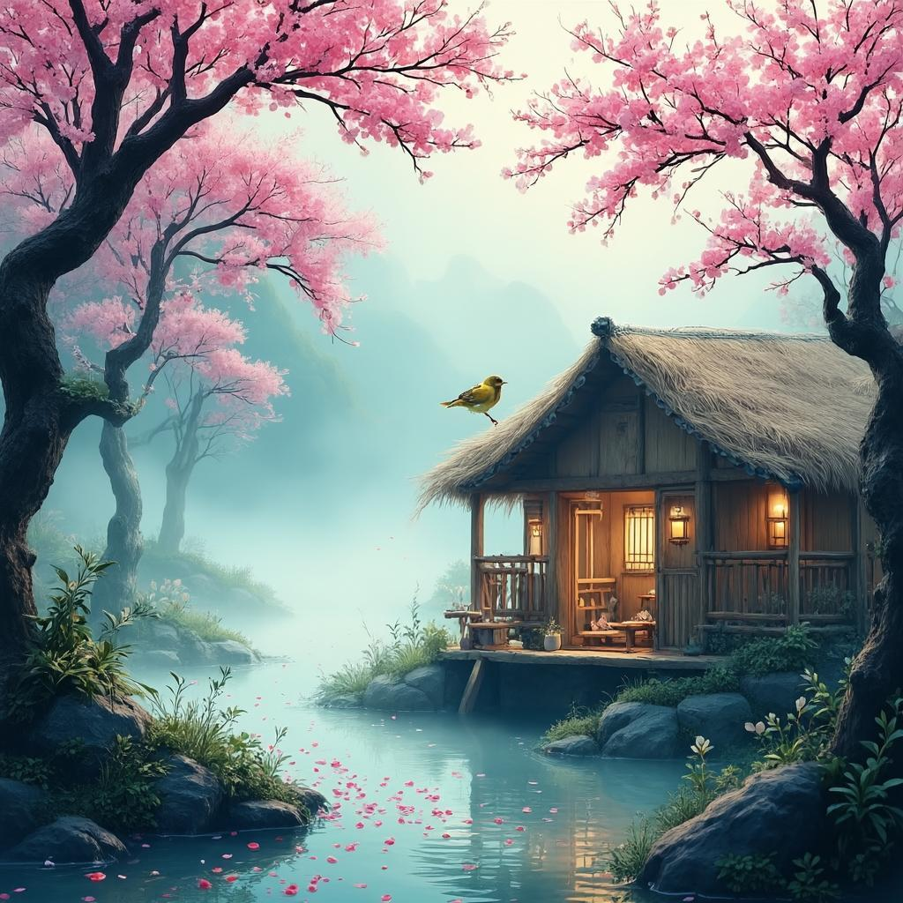

# 田园乐
**作者**：王维 ｜ **朝代**：唐代

## 🎵 诗词朗读
<audio controls>
  <source src="./data/mp3/田园乐_audio.mp3" type="audio/mpeg">
  您的浏览器不支持音频播放。
</audio>

📥 [下载音频文件](./data/mp3/田园乐_audio.mp3)

## 🖼️ 诗意画境


🖼️ [查看原图](./data/images/田园乐_王维.jpg)

---
## 📜 原文
```
桃红复含宿雨，柳绿更带朝烟。
花落家童未扫，莺啼山客犹眠。
```
## 🎯 主题
《田园乐》通过描绘春日清晨的自然景象和闲适生活，表达了诗人对宁静田园生活的向往和赞美。诗中"桃红含宿雨，柳绿带朝烟"展现了清新自然的春景，而"花落未扫"、"莺啼犹眠"则勾勒出一幅不受世俗烦扰的恬淡生活画面。全诗体现了王维追求闲适淡泊、与自然和谐共处的生活态度，以及远离尘世喧嚣、回归自然的隐逸思想，反映了中国传统文人"天人合一"的哲学观念和对理想生活的精神追求。
## 🏗️ 结构
《田园乐》是王维创作的一首五言绝句，其结构特点体现了王维诗歌"诗中有画"的艺术特色。从章法布局来看，这首诗采用了传统的"起承转合"结构：

首句"桃红复含宿雨"为起句，描绘桃花带着夜雨的景象，开篇即点出春日田园的主题。第二句"柳绿更带朝烟"是承句，继续描绘春晨景色，与上句形成色彩对比，桃红与柳绿相映成趣。第三句"花落家童未扫"为转句，由自然景色转向人事活动，但以"未扫"的静态呈现，形成巧妙转折。末句"莺啼山客犹眠"是合句，将全诗收束，以莺啼的动态与山客安眠的静态形成对比，点出"乐"的主题。

在层次安排上，这首诗具有多重层次：

空间层次上，由近及远，从桃、柳等近景到家童、山客等人物活动，再到莺啼这一声音元素，构建立体空间感。时间层次上，从"宿雨"到"朝烟"，再到"花落"和"莺啼"，暗示了从清晨到上午的时间流程。动静结合方面，"桃红"、"柳绿"是静态，"含宿雨"、"带朝烟"带有动态感；"花落"是动态，"未扫"是静态；"莺啼"是动态，"犹眠"是静态，形成动静相生的艺术效果。

此外，诗中前两句和后两句分别形成对仗："桃红"对"柳绿"，"宿雨"对"朝烟"；"花落"对"莺啼"，"家童"对"山客"，"未扫"对"犹眠"，结构工整和谐。情感表达上也呈现出从客观描写到主观感受的递进关系，最终将诗人自身融入画面，体现了王维追求自然闲适的生活态度。

这首诗虽仅二十字，却结构严谨，层次丰富，意境深远，充分展现了王维山水田园诗的艺术成就。
## ✍️ 语言风格
王维的《田园乐》体现了其作为"诗佛"的独特语言风格，这首诗在用词和修辞手法上展现出鲜明的特点。

在用词方面，王维选择了简洁凝练的表达方式，全诗仅用28字便勾勒出一幅完整的田园春晨图。诗中色彩对比鲜明，"桃红"与"柳绿"形成强烈的视觉冲击，直接点明景物的色彩特征。同时，诗人善用自然意象，如"桃"、"柳"、"花"、"莺"等，营造出浓郁的田园氛围。时间词的运用也极为精准，"宿雨"指昨夜的雨露，"朝烟"指早晨的雾气，共同构建了清晨的时间背景。人物词如"家童"、"山客"则含蓄地暗示了人物的存在，但不作直接描写，体现了王维诗歌的含蓄特质。

在修辞手法上，这首诗运用了多种技巧。前两句"桃红复含宿雨，柳绿更带朝烟"形成工整的对偶，结构对称，音韵和谐。诗人还通过意象叠加的手法，将"桃红"与"宿雨"、"柳绿"与"朝烟"巧妙结合，丰富了画面的层次感。借景抒情是王维诗歌的显著特点，他通过描绘自然景色，间接表达对田园生活的热爱与向往。诗中动静结合的描写也颇具匠心，既有静态的"桃红"、"柳绿"，也有动态的"花落"、"莺啼"，使画面生动鲜活。此外，诗人还善于以小见大，通过"家童未扫"、"山客犹眠"这样的生活细节，反映出整个田园生活的闲适与宁静。

整体而言，这首诗语言清新自然，不事雕琢，看似平淡却蕴含深意。王维通过简洁的语言勾勒出鲜明的画面，营造出清新、宁静、闲适的田园意境，达到了情景交融的艺术效果。作为一位擅长绘画的诗人，王维的这首《田园乐》充分体现了其"诗中有画"的艺术特色，展现了他对自然与生活的细腻观察和深刻感悟。
## 📚 文化札记
《田园乐》是唐代诗人王维的代表作之一，体现了盛唐山水田园诗的艺术特色和思想内涵。以下为诗中重要文化背景的注释：

王维（701-761），字摩诘，号摩诘居士，河东蒲州（今山西运城）人，唐代著名诗人、画家，官至尚书右丞，有"诗佛"之称。他精通诗、书、画、音乐，是文人画的开创者，其诗风清新淡远，意境空灵。

"田园乐"这一题目直接点明诗歌主题，反映了中国传统文化中文人士大夫对田园生活的向往。自陶渊明以来，田园生活成为文人逃避官场纷扰、追求精神自由的理想空间，代表了一种与自然和谐共处的生活哲学。

"桃红"在中国文化中象征春天、生命力与美好。桃花不仅具有自然美感，还与道教文化中的仙境、长生不老等概念相联系。"宿雨"指夜间雨水，在古诗中常用来营造清新湿润的氛围，暗示万物经过雨水滋润后更加生机勃勃。

"柳绿"与"桃红"形成色彩对比，共同构成春日景象。柳树在中国传统文化中是春天的象征，同时也常与离别、思念等情感相联系。"朝烟"指早晨的烟雾或雾气，在中国山水画和诗歌中，"烟"常用来表现朦胧、飘渺的意境，增添画面的层次感。王维作为画家，对这种视觉效果特别敏感。

"花落"暗示春天进程，在古典诗词中常与时光流逝、生命短暂等哲学思考相联系。"家童"指家中的童仆，表明诗中"山客"（很可能是诗人自己）虽隐居山林，但仍保持着士大夫阶层的生活条件，有仆人照料日常起居。"未扫"表现了一种自然、不刻意的生活态度，体现对自然规律的顺应。

"莺啼"中莺是春天常见的鸟类，其鸣叫声清脆悦耳，在古典诗词中与春天几乎是固定搭配。"山客"指山中的客人，很可能是诗人自称。王维曾在终南山等地隐居，自称"山客"符合其隐士身份，同时也暗示了他对隐居生活的复杂态度——既是参与者，又是旁观者。"犹眠"表现悠闲自在的生活状态，不受外界干扰，按照自己节奏生活，体现隐逸生活的核心价值。

这首诗体现了中国传统的隐逸文化，反映了王维在经历安史之乱后对政治生活的厌倦，转向佛教和隐逸生活的心路历程。诗中流露出的顺应自然、超然物外的态度，与王维笃信佛教的思想密切相关。同时，诗中鲜明的色彩和层次丰富的意象，也展现了王维"诗中有画"的艺术特色，对后世中国文学和艺术产生了深远影响。

此诗可能创作于王维在终南山或蓝田辋川别业隐居期间。终南山位于今陕西省西安市南，是唐代隐士聚集地，也是道教和佛教的重要圣地；蓝田辋川则是王维购置的庄园，他在此创作了大量描绘自然风光和隐逸生活的诗歌，后汇编成《辋川集》。
## 🌅 创作背景
《田园乐》创作于唐代天宝年间（约742-756年），地点在王维位于长安城南的辋川别业（今陕西蓝田县）。这一时期，王维已历官场起伏，从早年曾任右拾遗、监察御史等职，到安史之乱后被俘复官，逐渐对仕途心生厌倦，转向佛教禅宗思想，过着半官半隐的生活。在辋川别业，他与友人裴迪等唱和，沉浸于自然山水之中，心境趋于平和淡泊。

当时的历史背景是唐朝由盛转衰的关键时期。开元盛世的繁荣已逝，天宝年间朝政日益腐败，唐玄宗沉溺享乐，最终导致安史之乱爆发。社会动荡不安，许多文人对现实产生失望，纷纷寻求精神慰藉，隐逸之风盛行。王维作为这一时期的代表诗人，其作品深刻反映了这种社会心态。

王维创作《田园乐》的动机主要源于对田园生活的热爱和对自然之美的感悟。诗中"桃红"、"柳绿"、"花落"、"莺啼"等景象，都是他在辋川别业日常所见的真实写照。同时，受禅宗思想影响，他追求"物我两忘"的境界，通过描绘自然景物表达对闲适生活的向往和心灵自由的追求。作为一位画家，王维的诗歌常带有画意，这首诗就如一幅清新淡雅的水墨画，展现了他对自然美的独特感知和艺术表现力，体现了他"诗中有画"的艺术特色和"诗佛"的精神境界。
## 💭 情感基调
《田园乐》的情感基调以宁静闲适为主，表现出诗人对田园生活的恬淡向往和超脱心态。诗中描绘的景象清新自然，桃红柳绿、宿雨朝烟构成了一幅色彩鲜明而又湿润柔和的春晨图景。氛围特点则体现为和谐融洽，家童未扫、山客犹眠的闲适场景，展现了人与自然和谐共处的理想状态。整首诗流露出悠然自得的生活情趣，没有喧嚣与紧张，只有静谧与安逸，体现了王维山水田园诗"诗中有画"的艺术特色和"空灵淡远"的美学追求。
## 🔍 赏析
王维的《田园乐》以简约的笔墨勾勒出一幅春日清晨的田园画卷，体现了诗人"诗中有画"的艺术特色。诗中通过"桃红"与"柳绿"的鲜明色彩对比，"宿雨"与"朝烟"的自然现象交织，营造出清新湿润、生机盎然的春日意境。动静结合的艺术手法使画面更加生动——花落、莺啼的动态与家童未扫、山客犹眠的静态形成对比，既展现了自然的活力，又突显了田园生活的宁静。

语言上，这首诗凝练而富有表现力，仅用二十字便勾勒出完整的意境。前两句对偶工整，"桃红复含宿雨，柳绿更带朝烟"，结构匀称，音律和谐。诗人巧妙运用"含"、"带"等动词，赋予自然景物以人的情态，使画面更具生命力。色彩词的精准运用，如"桃红"、"柳绿"，增强了视觉冲击力，使读者如临其境。

情感表达上，诗人流露出对自然的热爱和对闲适生活的向往。"花落家童未扫，莺啼山客犹眠"两句，以平淡的笔调描绘了不受世俗烦扰的宁静生活，反映了诗人超然物外、淡泊名利的心境。诗中蕴含着佛教的超脱与禅意，体现了王维作为"诗佛"的精神追求。

这首诗虽短小精悍，却意境完整，艺术手法纯熟，是盛唐山水田园诗的典范之作。它不仅展现了中国传统文人对田园生活的向往，也体现了"天人合一"的哲学思想。对后世而言，这首诗影响深远，既成为中国文学史上田园诗的重要范本，也为历代文人提供了生活理想和价值取向。在现代社会快节奏生活的背景下，诗中所展现的宁静、闲适的生活态度，对现代人追求心灵平衡、缓解生活压力仍具有积极的启示意义。
## 📖 相关作品
山居秋暝 王维，过故人庄 孟浩然，归园田居·其一 陶渊明
## 🏷️ 标签
田园诗, 山水诗, 盛唐诗歌, 禅意诗, 田园生活, 自然景观, 春季景色, 日常生活, 恬淡, 闲适, 宁静, 愉悦, 写景, 白描, 对仗, 色彩鲜明
